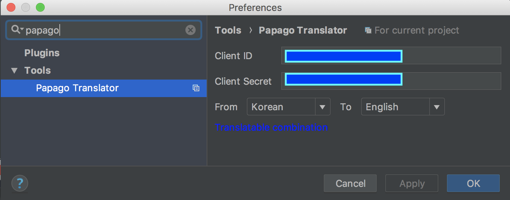

# papago-translator
파파고를 이용한 IntelliJ 번역 플러그인
* 본 플러그인은 Editor 영역에서 선택 된 단어 또는 문장을 번역합니다.
* 한글 주석을 영어로 번역하는 작업을 위해 만들었고, 그 기능에만 충실한 버전입니다.
* 사용 전 하단 키 발급 방법을 참조하여 키를 발급받으시기 바랍니다.
* 단축키는 설정에서 변경 가능합니다.

## 사용법
### 확인 후 번역
단축키 : ```option+1``` ```alt+1(win)```


### 바로 번역
단축키 : ```option+2``` ```alt+2(win)```


## 키 발급 방법
### 1. Naver 개발자 사이트에 접속하여 ( 회원가입/로그인 후 ) 애플리케이션을 등록합니다.

 ( https://developers.naver.com/apps/#/list )
 

 
 * 사용 API 에서 Papago NMT번역 선택
 * 환경추가 버튼 클릭 후 WEB설정 선택
 * 웹서비스 URL에 http://localhost 입력 ( 선택 )
 * 등록하기 버튼 클릭 후 생성 된 Client ID, Client Secret
 
 
### 2. Preferences -> tools -> Papago Translator 메뉴를 열어 위 1번 항목의 절차를 통해 발급 받은 client ID, client secret을 등록한 후 번역할 언어를 선택합니다.





### Change notes

## v 0.1.0 ( 2018-05-29 )

* Support for multilingual translations ()

## v 0.0.1 ( 2018-05-28 )

* Project Initiate.


